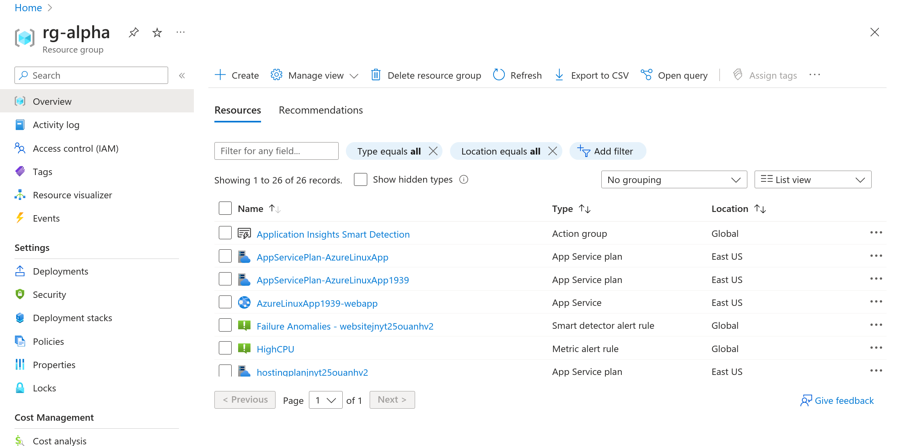

# **Azure Monitor: Deploy and Configure** 

## 📋 **Table of Contents**
- [**Azure Monitor: Deploy and Configure**](#azure-monitor-deploy-and-configure)
  - [📋 **Table of Contents**](#-table-of-contents)
  - [🚀 **Project Overview**](#-project-overview)
    - [**Objective**](#objective)
    - [**Executive Summary**](#executive-summary)
  - [🏗️ **Architecture**](#️-architecture)
    - [**System Design**](#system-design)
    - [**Component Breakdown**](#component-breakdown)
  - [💻 **Technologies Used**](#-technologies-used)
  - [📂 **Project Structure**](#-project-structure)
    - [**Folder Purpose**](#folder-purpose)
  - [🔧 **Prerequisites**](#-prerequisites)
    - [**System Requirements**](#system-requirements)
    - [**Credentials Needed**](#credentials-needed)
  - [🛠️ **Installation**](#️-installation)
    - [**Quick Start**](#quick-start)
    - [**Customizations**](#customizations)
  - [**Deployment**](#deployment)
    - [**Provisioning Resources**](#provisioning-resources)
  - [📷 **Screenshots**](#-screenshots)
    - [**Infrastructure Deployment**](#infrastructure-deployment)
  - [📊 **Performance Metrics**](#-performance-metrics)
  - [🔒 **Security Considerations**](#-security-considerations)
  - [🛠️ **Troubleshooting**](#️-troubleshooting)
  - [🤝 **Contributing**](#-contributing)
  - [📄 **License**](#-license)

---

## 🚀 **Project Overview**
### **Objective**
- **Master the deployment and configuration of Azure Monitor** to gain insight into cloud infrastructure and application performance.
- **Enhance operational efficiency** by enabling automated monitoring, alerting, and diagnostics.
- **Automate resource provisioning** using **Infrastructure as Code (IaC) with Terraform** for consistency and scalability.

### **Executive Summary**
This project focuses on the **deployment and configuration of Azure Monitor**. The infrastructure and monitoring setup are automated using Terraform, enabling efficient provisioning and consistent configuration. Key activities include creating log analytics workspaces, configuring alerts, and enabling log monitoring for compute services and web applications.

## 🏗️ **Architecture**
### **System Design**


### **Component Breakdown**
- **Azure Monitor**: Collects and analyzes telemetry data.
- **Log Analytics**: Centralized workspace for log data from Azure resources.
- **Azure VMs**: Includes both Windows and Linux-based virtual machines.
- **Web Apps & SQL Databases**: Hosted web applications monitored by Azure Monitor.
- **Alerts and Notifications**: Alerts are configured to trigger notifications for critical events.
- **IaC (Terraform)**: Automates the deployment of the entire infrastructure.

## 💻 **Technologies Used**
| **Category**        | **Technologies**          |
|--------------------|--------------------------|
| **Cloud Platform**  | Azure                    |
| **IaC**             | Terraform                 |
| **Monitoring**      | Azure Monitor, Log Analytics |
| **Configuration**   | Azure Active Directory, Resource Groups |
<p align="left">
  <a>
    
  </a>
</p>

---

## 📂 **Project Structure**
```
azure-monitor-deploy/
├── terraform/
│   ├── main.tf
│   ├── variables.tf
│   ├── variables.auto.tfvars
│   ├── remote_backend.tf
│   └── provider.tf
├── ManualDeploymentInstructions/
│   ├── Exercise 0: Prepare Your Azure Environment
│   ├── Exercise 1: Deploy Log Analytics
│   ├── Exercise 2: Monitor Web Apps
│   ├── Exercise 3: Configure Monitoring for Compute Services
│   └── Exercise 4: Configure Alerts
├── screenshots/
├── README.md
└── LICENSE
```

### **Folder Purpose**
- **`terraform/`**: Contains the IaC (Infrastructure as Code) files for resource provisioning.
- **`ManualDeploymentInstructions/`**: Detailed instruction to accomplish each task through manual deployment.
- > #### Navigating Through the Exercises: 
     > Each exercise provides a series of tasks to be completed sequentially. Navigate to the corresponding exercise directory and follow the instructions provided in the markdown files for each task.
- **`screenshots/`**: Images to showcase project milestones and architecture.
- **`README.md`**: The main documentation file.


## 🔧 **Prerequisites**
### **System Requirements**
- **Azure Subscription**: Ensure you have an active Azure subscription.
- **Terraform**: Install the latest version of Terraform.
- **Azure CLI**: Required to interact with Azure resources.
- **Admin Access**: Global administrator access to the Azure subscription.

### **Credentials Needed**
- Azure Service Principal for authentication.
- Administrator access for the SQL Database.
- IAM access to create security groups and resource groups.

## 🛠️ **Installation**
### **Quick Start**
```bash
# Step 1: Clone the repository
git clone https://github.com/vsingh55/Azure-Monitor-Deploy-and-Configure.git

# Step 2: Change directory to the terraform folder
cd azure-monitor-deploy/terraform/

# Step 3: Initialize Terraform
terraform init

# Step 4: Apply the infrastructure configuration
terraform apply -auto-approve
```

This will deploy the resource group, VMs, web apps, SQL database, and configure Azure Monitor services.


### **Customizations**
- Update **`variables.tf`** & **`variables.auto.tfvars`** to customize region, resource group names, and VM sizes.


## **Deployment**
### **Provisioning Resources**
1. **Resource Group**: Creates an Azure resource group (e.g., `rg-alpha`).
2. **Security Group**: Deploys a security group named **App Log Examiners**.
3. **Virtual Machines**: Deploys **WS-VM1 (Windows Server)** and **LX-VM2 (Linux Ubuntu Server)**.
4. **Web App + SQL Database**: Deploys a web app integrated with an SQL database.
5. **Log Analytics**: Creates a Log Analytics workspace for monitoring.
6. **Alerts and Metrics**: Configures alerts for VM CPU utilization, storage capacity, and more.


## 📷 **Screenshots**
### **Infrastructure Deployment**
   


## 📊 **Performance Metrics**
- **Provisioning Time**: ~20 minutes for full resource setup.
- **Availability**: Resources are monitored using **Log Analytics** and **Application Insights**.
- **Scalability**: Auto-scaling for virtual machines can be configured.
- **Alerts**: Email notifications are triggered for high CPU usage.


## 🔒 **Security Considerations**
- **IAM Roles**: Limit roles to the least privilege necessary.
- **Access Control**: Use IP-based RDP restrictions for **WS-VM1**.
- **Data Protection**: SQL database credentials are stored in Azure Key Vault.
- **Logging**: Centralized log storage using **Log Analytics**.

---

## 🛠️ **Troubleshooting**
| **Issue**             | **Possible Cause**              | **Solution**                |
|----------------------|----------------------------------|-----------------------------|
| **Terraform Apply Fails** | Authentication failure      | Check Azure credentials |
| **RDP Connection Issues**  | IP Restriction Issue       | Allow RDP from **My IP** only    |
| **Alerts Not Triggering**   | Misconfigured threshold   | Reconfigure alert thresholds     |


## 🤝 **Contributing**
Contributions are welcome! To contribute:
1. Fork the repository.
2. Create a new branch (`git checkout -b feature-name`).
3. Commit your changes (`git commit -m 'Add feature name'`).
4. Push to the branch (`git push origin feature-name`).
5. Create a pull request.


## 📄 **License**
This project is licensed under the **MIT License**. See [LICENSE](./LICENSE) for more information.

